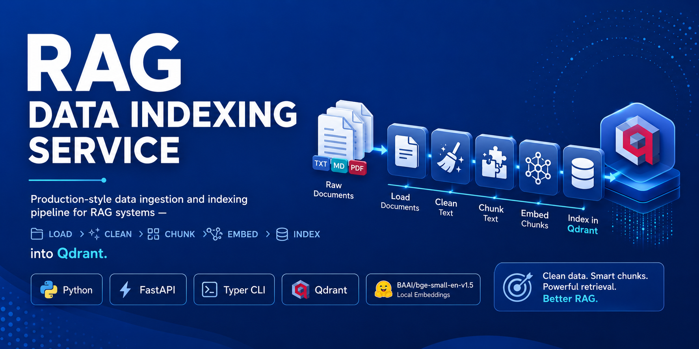

<div align="center">
    
</div>

<h1 align="center">RAG Data Indexing Service</h1>

<p align="center">
  Production-style data ingestion and indexing pipeline for RAG systems —
  load, clean, chunk, embed, and index documents into Qdrant.
</p>

---

***Table of Contents***

<details>
  <summary><a href="#1-about-this-repository"><i><b>1. About This Repository</b></i></a></summary>
  <div>
    &nbsp;&nbsp;&nbsp;&nbsp;&nbsp;&nbsp;&nbsp;&nbsp;&nbsp;&nbsp;<a href="#11-who-is-this-for">1.1. Who Is This For?</a><br>
    &nbsp;&nbsp;&nbsp;&nbsp;&nbsp;&nbsp;&nbsp;&nbsp;&nbsp;&nbsp;<a href="#12-what-will-you-learn">1.2. What Will You Learn?</a><br>
    &nbsp;&nbsp;&nbsp;&nbsp;&nbsp;&nbsp;&nbsp;&nbsp;&nbsp;&nbsp;<a href="#13-prerequisites">1.3. Prerequisites</a><br>
  </div>
</details>
&nbsp;

<details>
  <summary><a href="#2-quick-start"><i><b>2. Quick Start</b></i></a></summary>
  <div>
    &nbsp;&nbsp;&nbsp;&nbsp;&nbsp;&nbsp;&nbsp;&nbsp;&nbsp;&nbsp;<a href="#21-prerequisites">2.1. Prerequisites</a><br>
    &nbsp;&nbsp;&nbsp;&nbsp;&nbsp;&nbsp;&nbsp;&nbsp;&nbsp;&nbsp;<a href="#22-steps">2.2. Steps</a><br>
  </div>
</details>
&nbsp;

<div>
  &nbsp;&nbsp;&nbsp;&nbsp;<a href="#3-pipeline"><i><b>3. Pipeline</b></i></a>
</div>
&nbsp;

<div>
  &nbsp;&nbsp;&nbsp;&nbsp;<a href="#4-project-structure"><i><b>4. Project Structure</b></i></a>
</div>
&nbsp;

<div>
  &nbsp;&nbsp;&nbsp;&nbsp;<a href="#5-notebooks"><i><b>5. Notebooks</b></i></a>
</div>
&nbsp;

<details>
  <summary><a href="#6-service-layer"><i><b>6. Service Layer</b></i></a></summary>
  <div>
    &nbsp;&nbsp;&nbsp;&nbsp;&nbsp;&nbsp;&nbsp;&nbsp;&nbsp;&nbsp;<a href="#61-http-api">6.1. HTTP API</a><br>
    &nbsp;&nbsp;&nbsp;&nbsp;&nbsp;&nbsp;&nbsp;&nbsp;&nbsp;&nbsp;<a href="#62-cli">6.2. CLI</a><br>
  </div>
</details>
&nbsp;

<div>
  &nbsp;&nbsp;&nbsp;&nbsp;<a href="#7-testing"><i><b>7. Testing</b></i></a>
</div>
&nbsp;

<div>
  &nbsp;&nbsp;&nbsp;&nbsp;<a href="#8-configuration"><i><b>8. Configuration</b></i></a>
</div>
&nbsp;

<div>
  &nbsp;&nbsp;&nbsp;&nbsp;<a href="#9-contact"><i><b>9. Contact</b></i></a>
</div>
&nbsp;

---

# 1. About This Repository

`rag-data-indexing-service` is the data preparation layer of a production-style RAG system. It takes raw documents, cleans them, splits them into chunks, enriches each chunk with metadata, generates vector embeddings, and stores everything in Qdrant — ready for downstream retrieval.

This repository does not implement answer generation, LLM calls, or retrieval benchmarking. For the full project specification, see [`docs/Project_Goal.md`](docs/Project_Goal.md).

## 1.1. Who Is This For?

ML engineers and backend developers who want to understand and implement the data preparation layer of a production RAG system. The pipeline is first explored step by step in Jupyter notebooks, then packaged as a reusable FastAPI service and Typer CLI.

## 1.2. What Will You Learn?

- Loading `.txt`, `.md`, and `.pdf` documents from disk
- Cleaning text: unicode normalization, control-character removal, whitespace collapsing
- Three chunking strategies: character, recursive, and token-aware
- Generating local embeddings with `BAAI/bge-small-en-v1.5` (free, no API key)
- Storing and querying vectors in Qdrant with cosine similarity
- Packaging the pipeline as a FastAPI HTTP API and a Typer CLI

## 1.3. Prerequisites

- Comfortable with Python
- Basic familiarity with Docker
- No prior RAG experience required

---

# 2. Quick Start

## 2.1. Prerequisites

- [Docker Desktop](https://www.docker.com/products/docker-desktop/) — Windows, macOS, or Linux
- `make` — pre-installed on Linux/macOS; on Windows use WSL or Git Bash

## 2.2. Steps

```bash
# 1. Clone the repository
git clone <repository-url>
cd rag-data-indexing-service

# 2. Copy the environment file
cp .env.example .env

# 3. Build and start the containers (JupyterLab + Qdrant)
make up

# 4. Download the SciFact dataset inside Docker
make download-data

# 5. Open JupyterLab at http://localhost:8888 and run notebooks 01 → 07

# 6. Stop everything
make down
```

| Service | URL |
|---|---|
| JupyterLab | http://localhost:8888 |
| Qdrant | http://localhost:6333 |

> Hugging Face model cache and Qdrant data are stored in named Docker volumes and persist across restarts. To also remove volumes: `docker compose down -v`.

---

# 3. Pipeline

```text
Raw Documents
  → Document Loading       app/pipeline/loaders/
  → Text Cleaning          app/pipeline/cleaning.py
  → Chunking               app/pipeline/chunking/
  → Metadata Enrichment    app/pipeline/metadata.py
  → Embedding              app/pipeline/embedding.py
  → Qdrant Indexing        app/pipeline/indexing/
```

Each stage is explored in a numbered Jupyter notebook first, then implemented as a reusable Python module in `app/pipeline/`.

---

# 4. Project Structure

```
Folder PATH listing
+---app                       <-- Production service layer (FastAPI + CLI)
+---config                    <-- Reserved for YAML config files
+---data                      <-- Raw and processed data (git-ignored)
+---docker                    <-- Reserved for extra Docker config
+---docs                      <-- Project goal and implementation plan
+---notebooks                 <-- Step-by-step pipeline notebooks (01-07)
+---scripts                   <-- Reserved for utility scripts
+---tests                     <-- Unit and integration tests
│       .dockerignore         <-- Docker build exclusions
│       .env.example          <-- Environment variable template
│       .gitignore            <-- Git exclusions
│       docker-compose.yml    <-- Service definitions (Jupyter, Qdrant, API)
│       Dockerfile            <-- Python + JupyterLab image definition
│       LICENSE               <-- MIT License
│       Makefile              <-- Developer shortcuts (up, test, lint...)
│       README.md             <-- This file
│       requirements.txt      <-- Python dependencies
│
```

---

# 5. Notebooks

Each notebook covers exactly one pipeline stage and reads the output of the previous one. Run them in order inside JupyterLab.

| Notebook | Phase | Description |
|---|---|---|
| `01_download_scifact_corpus.ipynb` | 1 | Download and normalize the SciFact corpus from Hugging Face |
| `02_clean_corpus.ipynb` | 2 | Clean text: unicode, control characters, whitespace |
| `03_chunk_corpus.ipynb` | 3 | Split documents into overlapping chunks |
| `04_enrich_metadata.ipynb` | 4 | Attach stable `chunk_id` and retrieval metadata |
| `05_generate_embeddings.ipynb` | 5 | Embed chunks locally with `BAAI/bge-small-en-v1.5` |
| `06_index_qdrant.ipynb` | 6 | Create the Qdrant collection and upsert vectors |
| `07_index_health_report.ipynb` | 7 | End-to-end query demo and index health report |

See [`notebooks/README.md`](notebooks/README.md) for the input and output file of each notebook.

---

# 6. Service Layer

The same pipeline logic from the notebooks is packaged as reusable modules in `app/`, exposed through a FastAPI HTTP API and a Typer CLI. See [`app/README.md`](app/README.md).

## 6.1. HTTP API

Start with `docker compose --profile api up`:

| Method | Path | Purpose |
|---|---|---|
| `GET` | `/health` | Liveness check |
| `POST` | `/ingest` | Run the full pipeline on a document folder |
| `GET` | `/collections/{name}/status` | Collection statistics |
| `DELETE` | `/collections/{name}` | Delete a collection for a clean rebuild |

Interactive docs: http://localhost:8000/docs

## 6.2. CLI

```bash
python -m app.cli ingest --input-dir ./data/raw --collection rag_scifact
python -m app.cli status --collection rag_scifact
python -m app.cli reset  --collection rag_scifact
```

---

# 7. Testing

```bash
make test
```

Unit tests run without a network connection or a running Qdrant server. Integration tests require the Qdrant container to be running. See [`tests/README.md`](tests/README.md) for details.

---

# 8. Configuration

Copy `.env.example` to `.env` and adjust values as needed:

| Variable | Default | Description |
|---|---|---|
| `QDRANT_URL` | `http://qdrant:6333` | Qdrant server URL |
| `QDRANT_COLLECTION` | `rag_scifact` | Default collection name |
| `EMBEDDING_MODEL` | `BAAI/bge-small-en-v1.5` | Local Hugging Face embedding model |
| `CHUNK_SIZE` | `800` | Maximum chunk size in characters |
| `CHUNK_OVERLAP` | `100` | Overlap between consecutive chunks |
| `CHUNKING_STRATEGY` | `recursive` | `character`, `recursive`, or `token` |
| `INPUT_DIR` | `./data/raw` | Directory to load documents from |

---

# 9. Contact

For questions or collaboration, connect with [Max Ghadri](https://www.linkedin.com/in/max-ghadri/) on LinkedIn.
